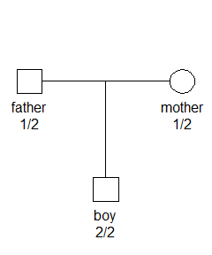

<!-- README.md is generated from README.Rmd. Please edit that file -->
pedlikCompare
=============

The purpose of pedlikCompare is to facilitate comparisons of software computing pedigree likelihoods. Such comparisons are invaluable for software developers, giving numerical validation of the implemented algorithms. Furthermore, by comparing runtimes one may identify and document strengths and weaknesses of each programs, potentially pinpointing computational bottlenecks that may be improved.

Several R packages are able to calculate pedigree likelihoods, including `pedprobr`, `paramlink`, `Familias`, `ElstonStewart`. Outside of R, a widely used program is MERLIN. The `pedlikCompare` package makes it easy and fun to compare all of these programs, both in terms of numeric accuracy and runtime. (For MERLIN to be included it must be installed on your computer.)

`pedlikCompare` imports the `pedtools` for creating pedigrees and markers. Conversion to all other formats are done automatically when needed.

Example
-------

Consider the pedigree shown below, where the parents are heterozygous for some marker, while the child is homozygous for the '2' allele. For simplicity we assume that the marker is a SNP with equal allele frequencies. We set this up with `pedtools` as follows:

``` r
library(pedtools)

x = nuclearPed(fa="father", mo="mother", child="boy")
m = marker(x, father = 1:2, mother = 1:2, boy = 2)

# Attach the marker
x = setMarkers(x, m)

# Plot
plot(x, marker=1)
```



Now load `pedlikCompare` and let it perform its magic! The crucial function is `compare()`:

``` r
library(pedlikCompare)
result = compare(x)
#> Program `pedprobr`...finished in 0.02 seconds
#> Program `paramlink`...finished in 0.00 seconds
#> Program `merlin`...finished in 0.28 seconds
#> Program `Familias`...finished in 0.00 seconds
#> Program `ElstonStewart`...finished in 0.00 seconds
result
#> # A tibble: 5 x 4
#>   program       likelihood lnlik   time
#>   <chr>              <dbl> <dbl>  <dbl>
#> 1 pedprobr          0.0625 -2.77 0.0156
#> 2 paramlink         0.0625 -2.77 0     
#> 3 merlin            0.0625 -2.77 0.283 
#> 4 Familias          0.0625 -2.77 0     
#> 5 ElstonStewart     0.0625 -2.77 0
```

The numbers indeed look the same. However the numbers are rounded when printed, so to be sure we use the `all_agree()` function. If you happen to know the exact likelihood, this can be supplied in the optional `answer` argument. In our example it is `1/16`, so the command becomes:

``` r
all_agree(result, answer = 1/16)
#> [1] TRUE
```
