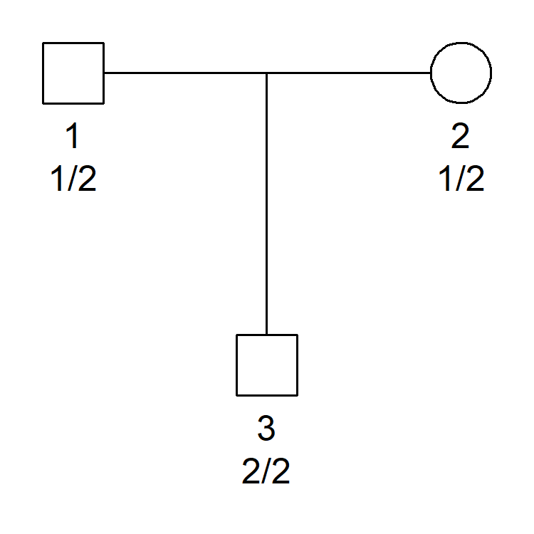

<!-- README.md is generated from README.Rmd. Please edit that file -->

# pedlikCompare

The purpose of **pedlikCompare** is to compare pedigree likelihoods
computed by different programs. Such comparisons are invaluable for
software developers, giving numerical validation of the implemented
algorithms. Furthermore, comparing runtimes may identify and document
strengths and weaknesses of each programs, potentially pinpointing
computational bottlenecks that may be improved.

Several R packages are able to calculate pedigree likelihoods, including
**pedprobr** (part of the
[pedsuite](https://magnusdv.github.io/pedsuite/)), **Familias**, and
**ElstonStewart**. Outside of R, a widely used program is
[**MERLIN**](https://csg.sph.umich.edu/abecasis/Merlin/). The
**pedlikCompare** package makes it easy and fun to compare all of these
programs, both in terms of numeric accuracy and runtime. (For MERLIN to
be included it must be installed on your computer.)

**pedlikCompare** imports **pedtools** for creating pedigrees and
markers. Conversion to all other formats are done automatically when
needed.

## Example

Consider the pedigree shown below, where a child and its parents have
been genotyped with a SNP marker. We set this up with **pedtools** as
follows:

``` r
library(pedtools)

x = nuclearPed() |> 
  addMarker(geno = c("1/2", "1/2", "2/2"), afreq = c(`1` = 0.5, `2` = 0.5))
```

Plot the pedigree to check that everything is ok.

``` r
plot(x, marker = 1)
```



Now let **pedlikCompare** perform its magic! The crucial function is
`compare()`.

``` r
library(pedlikCompare)
result = compare(x)
#> Program `pedprobr`...finished in 0 secs
#> Program `Familias`...finished in 0 secs
#> Program `ElstonStewart`...skipped. Package not installed
#> Program `merlin`...finished in 0.25 secs
#> ===> ALL PROGRAMS AGREE! <===
```

As indicated in the output, all programs agreed in this case. The
`result` object contains more details:

``` r
result
#> # A tibble: 3 × 4
#>   program  likelihood lnlik time      
#>   <chr>         <dbl> <dbl> <drtn>    
#> 1 pedprobr     0.0625 -2.77 0.002 secs
#> 2 Familias     0.0625 -2.77 0.003 secs
#> 3 merlin       0.0625 -2.77 0.250 secs
```

In order to compare the likelihoods, `compare()` calls the function
`all_agree()` which deals with rounding and other mundane issues. If you
happen to know the exact likelihood, this can be supplied in the
optional `answer` argument. In our example it is `1/16`, so the command
becomes:

``` r
all_agree(result, answer = 1/16)
#> [1] TRUE
```
